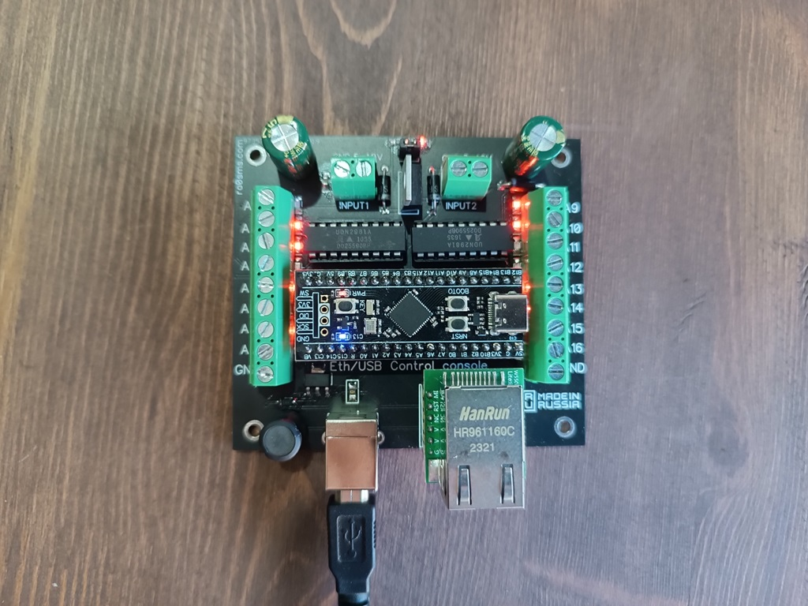
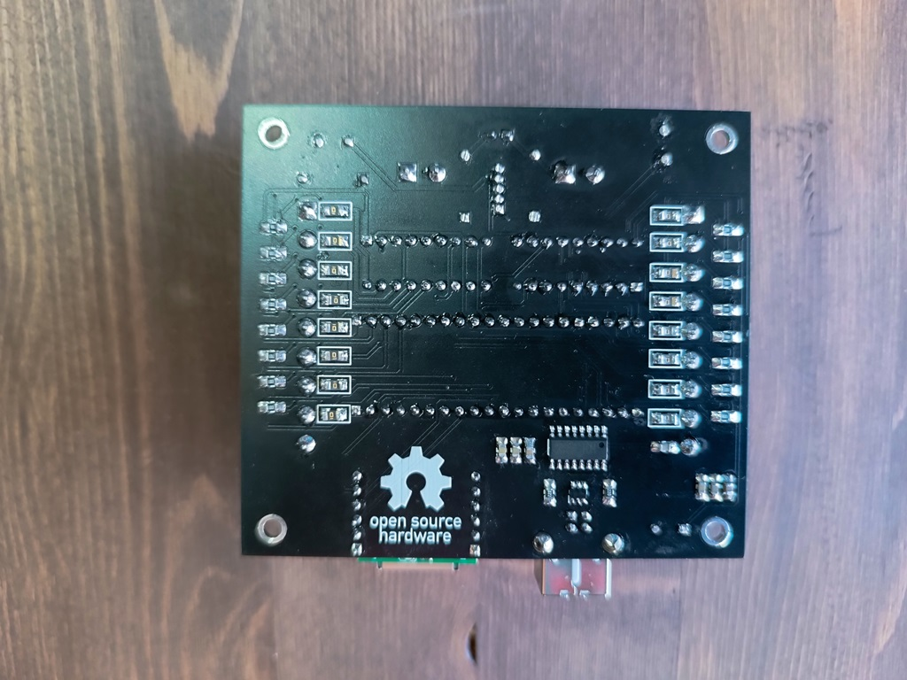
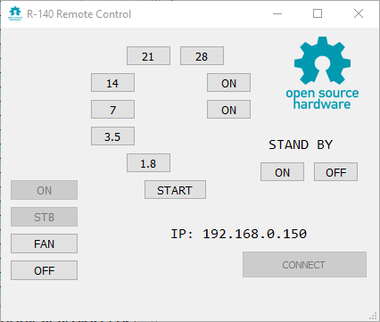

# Ethernet control console

All information about this device here (in Russian, but you can push the button "Translate") - https://ra0sms.com/ethernet-remote-control/

Instructions for Linux and raspberry pi installation here - https://github.com/ra0sms/R140_remote_control/blob/main/README.md

Some pics and schematic:

